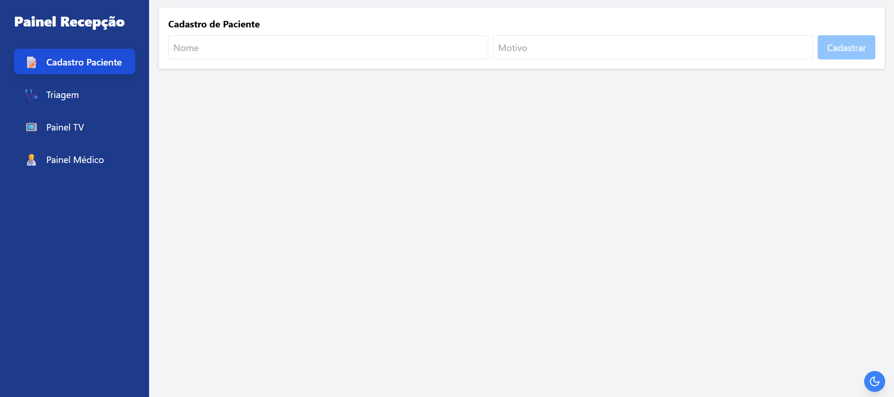
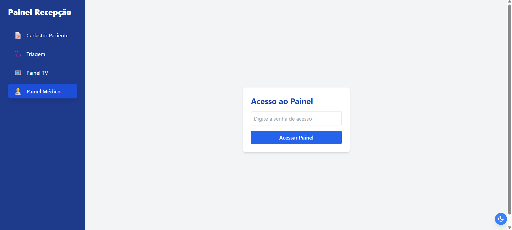

# Sistema de Controle de Atendimento

## Descrição

O projeto simula um **sistema de triagem hospitalar**, desenvolvido **sem backend**, utilizando apenas **React**, com persistência de dados no **localStorage**. O sistema permite o gerenciamento de pacientes por meio de classificação por prioridade (vermelho, amarelo, verde).

## Objetivos

- Criar um sistema de triagem que simula um ambiente hospitalar.
- Permitir o cadastro e classificação de pacientes.
- Gerenciar a fila de atendimento com base na prioridade da triagem.
- Armazenar todos os dados no `localStorage`.

## Tecnologias Utilizadas

- **React**: Criação da interface e gerenciamento de estado.
- **localStorage**: Armazenamento persistente dos dados.
- **Tailwind**: Estilização responsiva da interface.

## Funcionalidades

### 1. Cadastro de Paciente
- Registro do nome e motivo da visita.
- Atribuição automática de **cor de triagem**:
  - 🔴 Vermelho: Urgente
  - 🟡 Amarelo: Moderado
  - 🟢 Verde: Leve
- Geração de ficha e armazenamento no `localStorage`.

### 2. Classificação e Triagem
- Ordenação automática por prioridade.
- Edição manual da prioridade, se necessário.

### 3. Emissão de Fichas
- Fichas com nome, motivo e cor de triagem.

### 4. Interface Intuitiva
- Navegação clara e simples.
- Destaque visual para triagem por cor.

## Telas do Sistema

### Tela de Cadastro
- Formulário para nome e motivo da visita.
- Geração de ficha e inserção.

### Tela de Triagem 
- Lista de pacientes classificados.
- Botão para chamada manual e edição da triagem.

### Tela do Médico
- Lista de pacientes ordenada por prioridade.
- Botões para iniciar e finalizar atendimentos.
- Histórico de pacientes atendidos.

### Tela de Exibição
- Lista visível de pacientes e status atual.
- Chamada automática com destaque do próximo paciente.
- Indicadores de prioridade.

## Fluxo de Navegação

1. **Cadastro** 
2. **Triagem** 
3. **Atendimento Médico**
4. **Exibição Pública** 

## Objetivos de Aprendizagem

- Trabalhar com **componentes React** e **gerenciamento de estado**.
- Usar o **localStorage** para persistência de dados.
- Simular **fluxos reais de atendimento** com lógica de prioridade.
- Criar interfaces interativas e funcionais.

## Exemplos Visuais do site

## Como Rodar o Projeto

#### Clone o repositório
git clone https://github.com/limasantoss/projetofinal_fsm3tic20.git

#### Instale as dependências
npm install

#### Rode a aplicação
npm run dev